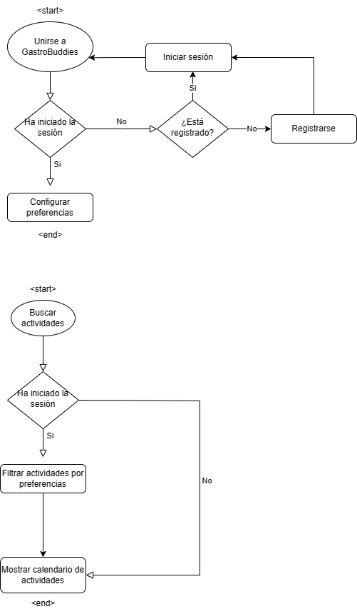
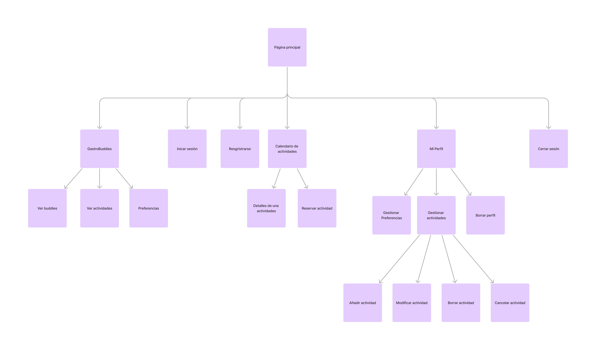

# DIU - Practica 2

## Descripción

En esta práctica vamos a ponernos en la piel de los usuairos de nuestra web y 
que partes de la misma son mas relevantes para ellos. 
Idearemos una propuesta de valor y definiremos que funcionalides ofreceremos

## Contenido

1. [Mapa empatia/POV e Insigths](#mapa-de-empatia)
2. [Propuesta de valor / ScopeCanvas](#propuesta-de-valor)
3. [Análisis de Tareas](#analisis-de-tareas)
4. [Mapa de sitio y etiquetado](#mapa-de-sitio)
5. [Bocetos](#bocetos)

---

## Mapa de empatia
Reflejamos que puede expresar pensar o decir un usuario de nuestra web o de las propias webs del mismo nicho del mercado. Exponemos varios puntos de vista y vemos que podmeos evitar para no dar porblemas y que puntos no estan lo suficientemente explotados.   
[Mapa Empatia](Entrega/Empathy%20Map%20Practica%202.pdf)

---

## Propuesta de valor
### Abstract
Nuestra propuesta de valor consiste en ofrecer un servicio web que mitigue las carencias más comunes que suelen tener las páginas webs. En particular, queremos hacer hincapié en la relevancia y utilidad de la información alojada puesto que en muchas ocasiones esta no aparece de forma clara o está escondida detrás de un esquema de navegación anti intuitiva e inhumana. Pretendemos liberar la información de la basura de palabrejas usadas para SEO y enfocarnos en contenido genuino y valioso para los usuarios.

Nos gustaría ofrecer una experiencia limpia,simple, consistente, sólida y madura sin complicaciones innecesarias o distracciones superfluas. Queremos que nuestros usuarios en un par de clicks obtengan toda la información necesaria para poder tomar decisiones sin tener que llamar por teléfono o escribir correos suplicando por la información. 

Nuestra meta es crear un entorno web donde la información sea accesible, relevante y fácil de encontrar, brindando a nuestros usuarios una experiencia satisfactoria y enriquecedora cada vez que acuden a nuestro servicio.

---

### Funcionalidad
Nuestro servicio trata de los siguientes módulos:
- Usuarios:
son tanto las personas que están interesadas en alguna actividad (clientes) como las que ofrecen servicios (empresas)

- Actividades:
Son servicios ofertados por las empresas con la información como Fecha, Precio, Lugar, Hora

- Buscador:
Permite buscar por etiquetas o palabras claves alguna actividad relacionada, por ejemplo: “Cocina andalusí”

- Calendario
Agrupa las actividades ofrecidas por fechas, proporcionando una visión temporal. 

- Tinder de actividades (GastroBuddies)
Los usuarios de la app tendrán una funcionalidad para concretar actividades de la siguiente forma:
1º - Definirán cuando quieren realizar una actividad. Por ejemplo: Sábado a partir de las 9.
2º - Luego te empezaran a salir una serie de actividades con una pequeña descripción que cuadren con tus preferencias de búsqueda y podrás darle me gusta o rechazar la actividad.
3º - Cuando suficientes usuarios hayan dado me gusta una actividad se les mandará un correo o notificación con la información de la actividad y si la aceptan tendrán reservada dicha actividad junto con los demás usuarios.

[Descripcion](Entrega/descripcion%20y%20propuesta%20de%20valor.pdf)   
[ScopeCanva](Entrega/scopecanva.pdf)

---

## Analisis de Tareas

Las actividades mas relevantes tras hacer el analisis son en orden decreciente de importancia:
1 - Unirse a GastroBuddies(Propuesta de valor)
2 - Buscar actividades
3 - Ver detalles de una actividad
4 - Buscar una actividad con filtros

[Análisis](Entrega/TASK%20ANALYSIS.pdf) 

## User Flow

## Mapa de sitio
En este sitemap se refleja la navegabilidad entre los diferentes elementos del sistema
  

## Labeling
A continuación se presenta el labeling de los elementos del sistema

  

---

## Bocetos
[Bocetos](Entrega/Bocetos.pdf)  

---
