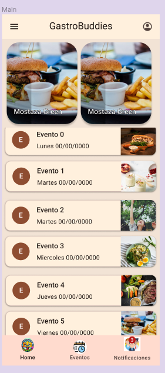
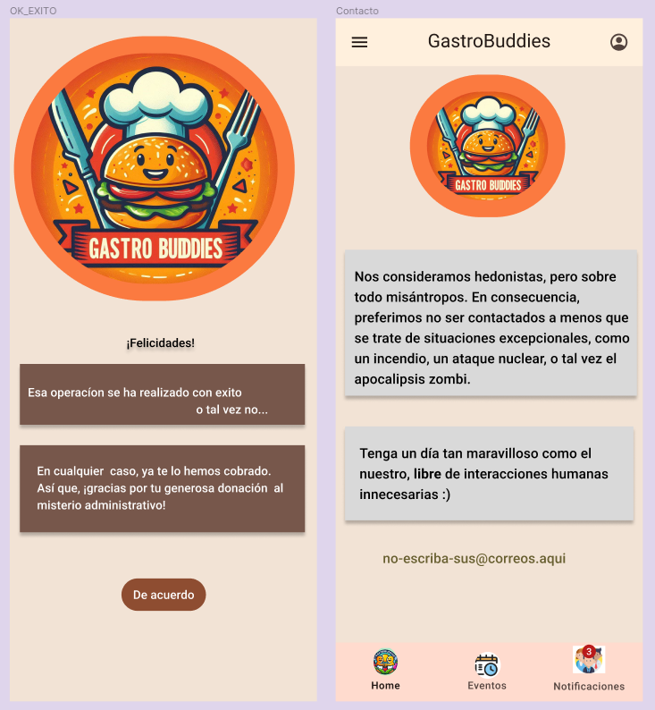

# DIU - Practica 3

## Descripción

Presentamos al inicio el moodboard con una serie de inspiraciones para luego empeazar nuestro propio diseño, pasamos al Landing Page donde plasmamos nuestras ideas formada con la auda de diferentes fuentes.
Luego en el diseño final y la publicación de nuestro Case Study donde plasmamos como quedarian muchas de las fases de nuestra app.

## Contenido

1. [Moodboard](#moodboard)
2. [Landing Page](#landing-page)
3. [Guidelines](#guidelines)
4. [Mockup: LAYOUT HI-FI](#mockup-layout-hi-fi)
5. [Publicación del Case Study](#publicación-del-case-study)

---

## Moodboard
Cogemos de diferentes fuentes inspiracion y plasmamos la fuente para de un vstazo poder sacar una idea o imagen de a donde queremos llegar y que aspecto debe de tener.
   

---

## Landing Page

En nuestro Landing Page, encontrarás algo mas que una imagen. Es un refeljo de lo que queremos trnasmitir: vibrante, acogedora y llena de posibilidades. Desde el primer vistazo, te guiamos hacia donde necesitas estar, ofreciendo pistas claras sobre dónde encontrarnos. Pero más que eso, queremos dar la sensacion de calma y curiosidad. Te invitamos a explorar, a sumergirte en lo que podrias descubrir aqui dentro.
 

---

## Guidelines

---

Tal y como sugiere el guion de la practica, se ha utilizado material ui. Se trata de un lenguaje de diseño desarrollado por Google que además trata de definir todas las caracteristicas de los elementos que forman una interfaz.  

De todos los elementos propuestos en el guion, debido a las limitaciones de la version gratuita de figma, se han utilizado:

- Onboarding
- Menu (navBar adaptada a móvil)
- Hero image + Carousel
- Form Input
- Item details + actions
- about

## Mockup: LAYOUT HI-FI

[Enlace al prototipo FIGMA](https://www.figma.com/design/NjBneDsaPI1mtTUAXnyj0P/%5BDosVocesUnCompas%5DEsto-es-mi-Practica-3?node-id=54795%3A1898&t=0cC1bGppXBtk2T8i-1)
----

---

## Publicación del Case Study

---
