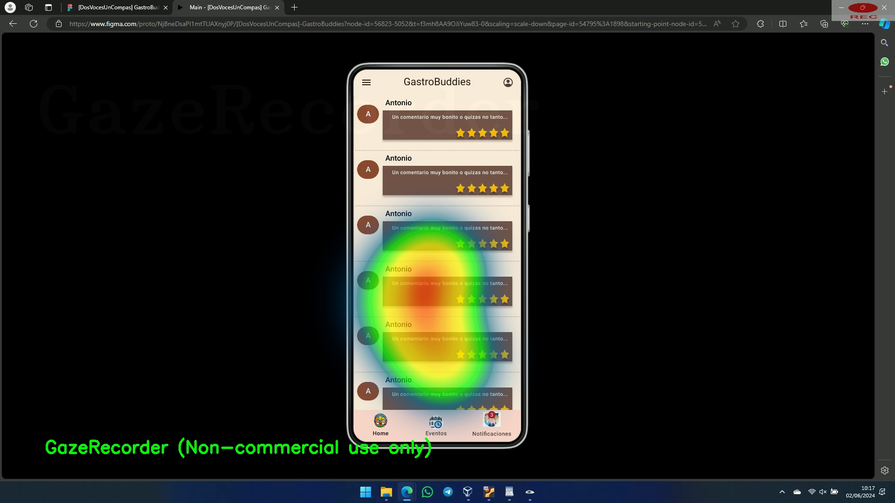

# Usability Report

Para redactar este documento hemos cogido de referencia el readme sugerido en el guión, no obstante se ha modificado ligeramente su estructura para ofrecer mayor claridad en cuanto a la estructura y el orden de la información. 

#### Evaluación de usabilidad del proyecto  DIU1.JORSES (EL RECETARIO)

Enlace GitHub: [DIU1-Jorses/DIU_P](https://github.com/DIU1-Jorses/DIU_P)

## Índice
1. [Descripción del Website](#1-descripción-del-website)
2. [Resumen Ejecutivo](#2-resumen-ejecutivo)
3. [Metodología](#3-metodología)
   - [Participantes](#31-participantes)
   - [Procedimiento](#32-procedimiento)
   - [Herramientas](#33-herramientas)
4. [Resultados](#4-resultados)
   - [Caso Juan](#41-caso-juan-el-recetario)
   - [Caso Maria](#42-caso-maria-el-recetario)
   - [Caso Pepe](#43-caso-pepe-gastrobuddies)
   - [Caso Isabel](#44-caso-isabel-gastrobuddies)
5. [Test SUS](#5-test-sus)
6. [Conclusiones](#6-conclusiones)

## 1. DESCRIPCIÓN DEL WEBSITE

El Recetario es una app que celebra la innovación y autenticidad culinaria, ofreciendo recetas de diferentes culturas, cursos y eventos gastronómicos. Su objetivo es hacer la cocina accesible, divertida y gratificante, proporcionando contenido de alta calidad que instruye e inspira.
 

## 2. RESUMEN EJECUTIVO

En este caso, realizaremos pruebas sobre el prototipo de la aplicación realizada por los compañeros del grupo [DIU1.Jorses](https://www.figma.com/proto/jhw2AZKXEF12lJCMCpxgAk/App?node-id=45-227&starting-point-node-id=2%3A2&t=YcdfXS5kxxGKb2Xf-1). Para ello, utilizaremos personas ficticias con el propósito de observar la usabilidad desde diferentes perfiles.

## 3. Metodología

La metodología que se utilizará es A/B mediante el eye tracking con los siguientes participantes:
- **Juan**: Estudiante universitario, extrovertido, con alta experiencia en TIC.
- **Maria**: Ama de casa, con experiencia media en TIC, aburrida.
- **Pepe**: Carpintero, baja experiencia en TIC, gruñón.
- **Isabel**: Profesora, con experiencia media en TIC, insegura.

### 3.1 Participantes

| Usuarios | Sexo/Edad     | Ocupación   |  Exp.TIC    | Personalidad | Plataforma | TestA/B
| ------------- | -------- | ----------- | ----------- | -----------  | ---------- | ----
| Juan     | H / 24   | Estudiante   | Alta        | Extrovertido | Web          | A 
| Maria    | M / 45   | Ama de casa  | Media       | Aburrida     | Movil        | A 
| Pepe     | H / 60   | Carpintero   | Baja        | Gruñón       | Web          | B 
| Isabel   | M / 32   | Profesor     | Media       | Insegura     | Movil        | B 

### 3.2 Procedimiento
Después de revisar la documentación del grupo DIU1.Jorses, hemos seleccionado estas tres tareas para evaluar, ya que coinciden con las tareas prioritarias de nuestro proyecto:
1. Registrarse
2. Buscar Actividades
3. Reservar Actividades

### 3.3 Herramientas
Utilizaremos Gaze Recorder para evaluar estas tareas. Cada usuario debe realizar las tareas de forma secuencial.

## 4. Resultados

### 4.1 Caso Juan (El Recetario)
En el caso de Juan, se han realizado varias calibraciones pero por alguna razón el software sugerido por el guion (Gaze recorder) no pudo calibrar correctamente. Después de varios intentos fallidos, juan se negó a seguir el estudio. 

### 4.2 Caso Maria (El recetario)
En esta medición se ha obtenido una mejor calibración. Se puede identificar claramente donde está mirando Maria. 

### 4.3 Caso Pepe (GastroBuddies)
Heatmaps de pepe

###  4.4 Caso Isabel (GastroBuddies)
Heatmaps de Isabel

## 5. Test SUS

Por último, ofrecemos resultados del cuestionario SUS rellenados por los usuarios

## 6. CONCLUSIONES 
Una vez obtenidos los resultados de las pruebas realizadas en los apartados anteriores, se puede observar que en ambos casos la experiencia de usuario ha sido en mayor o menor medida aceptable. Además, puesto que se trata de un prototipo que ni siquiera es una versión alpha, se puede decir que ambas propuestas han cumplido con los desafíos propuestos a lo largo de las prácticas de esta asignatura.

### En cuanto al caso B:
A modo de resumen, se puede destacar los siguientes puntos de de interés:
- El diseño es muy limpio y claro.
- La letra es legible.
- La información está agrupada por filas. (Comodo)
- Demasiada información para una pantalla móvil (Poco espacio)
- Los botones en el menú superior son demasiado pequeños.
- Hay un uso excesivo de carrusel + hero image.
- En el menú inferior, sería útil añadir pequeños títulos o iconos más autodescriptivos.

