# DIU24
Prácticas Diseño Interfaces de Usuario 2023-24 (Tema: .... ) 

## Grupo: DIU2_DosVocesUnCompas.  Curso: 2023/24 Updated: 11/2/2024

## Proyecto: GastroBuddies

### Descripción: 

> Nuestra propuesta consiste en ofrecer un servicio web en el que los usuarios puedan descubrir las ofertas gastronómicas en Granada

Logotipo: 
>>> Opcionalmente si diseña un logotipo para su producto en la práctica 3 pongalo aqui

Miembros:
- Tú
- Yo

----- 

# Proceso de Diseño 

## Paso 1. UX User & Desk Research & Analisis

Para poder realizar un user research podemos basarnos en una investigación cualitativa usando etnografías, entrevistas o observaciones directas, o una investigación cuantitativa realizando un análisis del comportamiento de los usuarios. 

En nuestro caso, nos hemos fijado en ofertas en Granada, en las opiniones de las personas y escogimos aquellas en las que la experiencia ha sido negativa de forma objetiva y analizarlas. Para lograr un resultado adecuado es evidente la necesidad de comunicación y empatía.

---

## 1.b Competitive Analysis
En nuestro caso hemos elegido dos páginas que hemos buscado [Patata Santa](https://www.patatasanta.com/) y [Garnata Tours](https://www.garnatatours.com/) ademas de la propia pagina que se propone en el guión. Para más detalles visite este [documento](P1/Entrega/Analisis%20competencia%20-%20Justificación.pdf)

Al final los puestos seguún nuestra clasificacion han sido:  
- 1º Granada Cooking  
- 2º Patata Santa  
- 3º Garnata 

---

## 1.c Persona
### 1.c.1 Carmen Maria
#### ¿Por que Maria?
>Carmen es una mujer de naturaleza artística, es bastante directa y no suele andar con rodeos. Suele decir las cosas tal y como las piensa, cosa que a veces le da un aire cateto y brusco a pesar de su refinado gusto músical. 

>Pasa muchas horas delante del piano pues está entregada al arte al 110% lo que le permite ofrecer un espectáculo de calidad y de muy alto nivel. No obstante, el precio a pagar
por volar tan alto es la soledad pues le queda muy poco tiempo para el ocio. 

>Tiene deseo de hacer nuevos amigos y conocer a nuevas personas.
Confiemos en que lo consiga en breve pues ahora mismo está en Granada y tiene ganas de descubrir la gastronomía local.

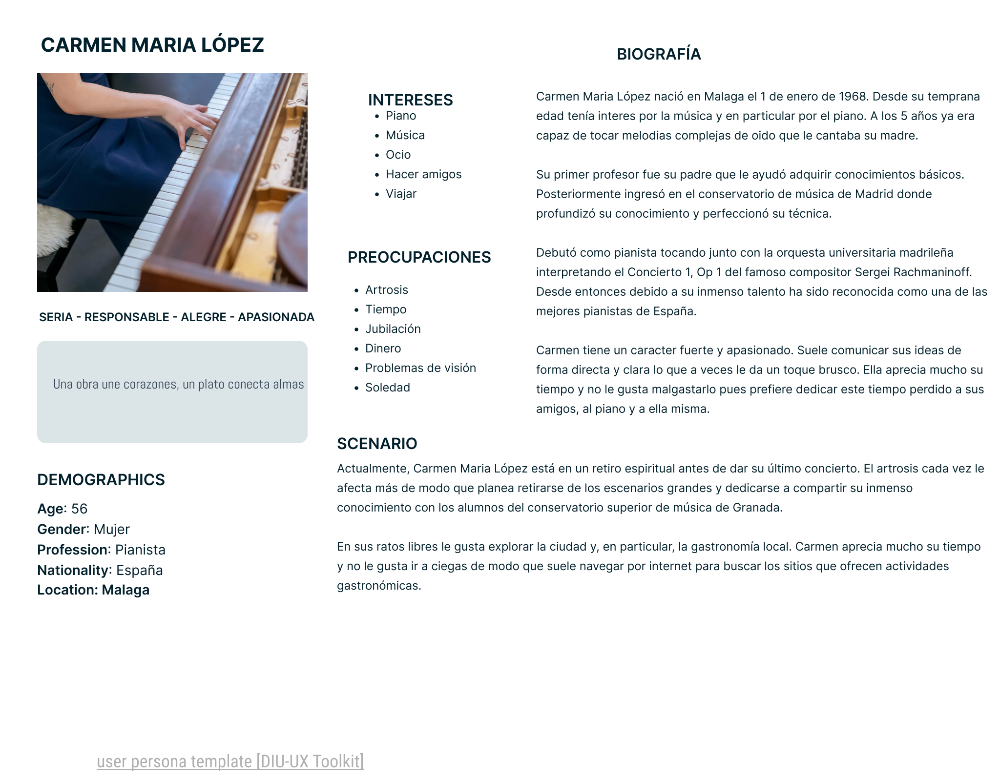  

### 1.c.2 Antonio Martin
#### ¿Por que Antonio?
>Antonio es un hombre de mediana edad inglés que se dispone a visitar granada. Esta es la premisa
principal sobre la que se desarrolla.
Teniendo en cuenta que nos basamos en la ciudad de granada para desarrollar la actividad donde
prolifera el turismo tener en cuenta a una persona cuyo origen es otro país puede ser una gran idea

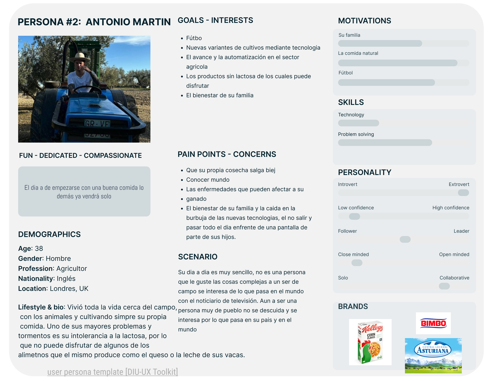  

## 1.d User Journey Map
### 1.d.1 Carmen Maria
>Carmen decide buscar sitios donde poder vivir
experiencias gastronómicas. Para ello decide usar internet. A continuación se ofrecen los pasos que realiza y las emociones que le acompañnan

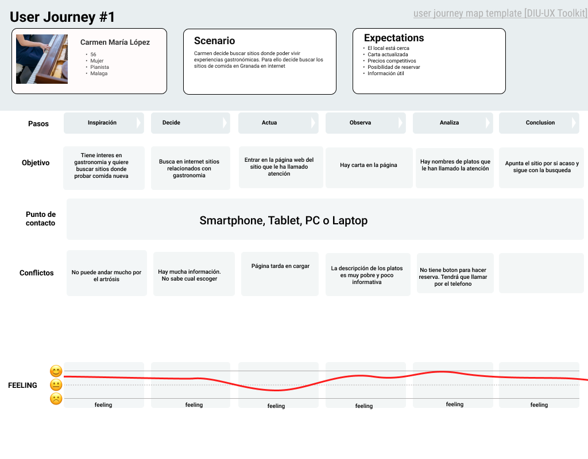

### 1.d.2 Antonio Martin
>Antonio es un hombre de mediana edad inglés que se dispone a visitar granada. Esta es la premisa
principal sobre la que se desarrolla.
Teniendo en cuenta que nos basamos en la ciudad de granada para desarrollar la actividad donde
prolifera el turismo tener en cuenta a una persona cuyo origen es otro país puede ser una gran idea.

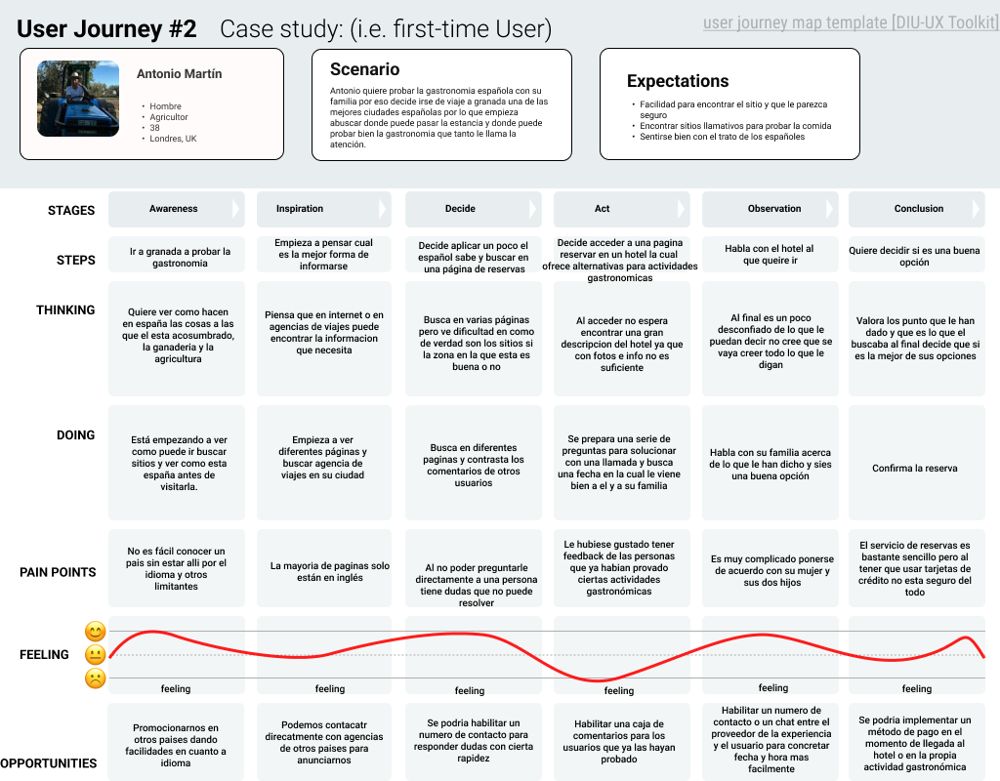  

---

## 1.e Usability Review
Enlaces a las valoraciones de usabilidad (Usability Reviews):

🔗[Usability Rebiew](P1/Entrega/UsabilityReview.pdf)

🥈 Valoración final (numérica): 59/100 - Moderado

> Los usuarios pueden usar la página y llevar al cabo las operaciones básicas. No obstante, la experiencia deja mucho que desear...

## Paso 2. UX Design  

 2.a Reframing / IDEACION: Feedback Capture Grid / EMpathy map 
----

Reflejamos que puede expresar pensar o decir un usuario de nuestra web o de las propias webs del mismo nicho del mercado. Exponemos varios puntos de vista y vemos que podmeos evitar para no dar porblemas y que puntos no estan lo suficientemente explotados.   

[Mapa Empatia](Entrega/Entregables/Empathy%20Map%20Practica%202.pdf)
    

 2.b ScopeCanvas
----
### Abstract
Nuestra propuesta de valor consiste en ofrecer un servicio web que mitigue las carencias más comunes que suelen tener las páginas webs. En particular, queremos hacer hincapié en la relevancia y utilidad de la información alojada puesto que en muchas ocasiones esta no aparece de forma clara o está escondida detrás de un esquema de navegación anti intuitiva e inhumana. Pretendemos liberar la información de la basura de palabrejas usadas para SEO y enfocarnos en contenido genuino y valioso para los usuarios.

Nos gustaría ofrecer una experiencia limpia,simple, consistente, sólida y madura sin complicaciones innecesarias o distracciones superfluas. Queremos que nuestros usuarios en un par de clicks obtengan toda la información necesaria para poder tomar decisiones sin tener que llamar por teléfono o escribir correos suplicando por la información. 

Nuestra meta es crear un entorno web donde la información sea accesible, relevante y fácil de encontrar, brindando a nuestros usuarios una experiencia satisfactoria y enriquecedora cada vez que acuden a nuestro servicio.

---

### Funcionalidad
Nuestro servicio trata de los siguientes módulos:
- Usuarios:
son tanto las personas que están interesadas en alguna actividad (clientes) como las que ofrecen servicios (empresas)

- Actividades:
Son servicios ofertados por las empresas con la información como Fecha, Precio, Lugar, Hora

- Buscador:
Permite buscar por etiquetas o palabras claves alguna actividad relacionada, por ejemplo: “Cocina andalusí”

- Calendario
Agrupa las actividades ofrecidas por fechas, proporcionando una visión temporal. 

- Tinder de actividades (GastroBuddies)
Los usuarios de la app tendrán una funcionalidad para concretar actividades de la siguiente forma:
1º - Definirán cuando quieren realizar una actividad. Por ejemplo: Sábado a partir de las 9.
2º - Luego te empezaran a salir una serie de actividades con una pequeña descripción que cuadren con tus preferencias de búsqueda y podrás darle me gusta o rechazar la actividad.
3º - Cuando suficientes usuarios hayan dado me gusta una actividad se les mandará un correo o notificación con la información de la actividad y si la aceptan tendrán reservada dicha actividad junto con los demás usuarios.

[Descripcion](P2/Entrega/Entregables/descripcion%20y%20propuesta%20de%20valor.pdf)   
[ScopeCanva](P2/Entrega/Entregables/scopecanva.pdf)

 2.b User Flow (task) analysis 
-----

 

 2.c IA: Sitemap + Labelling 
----

En este sitemap se refleja la navegabilidad entre los diferentes elementos del sistema
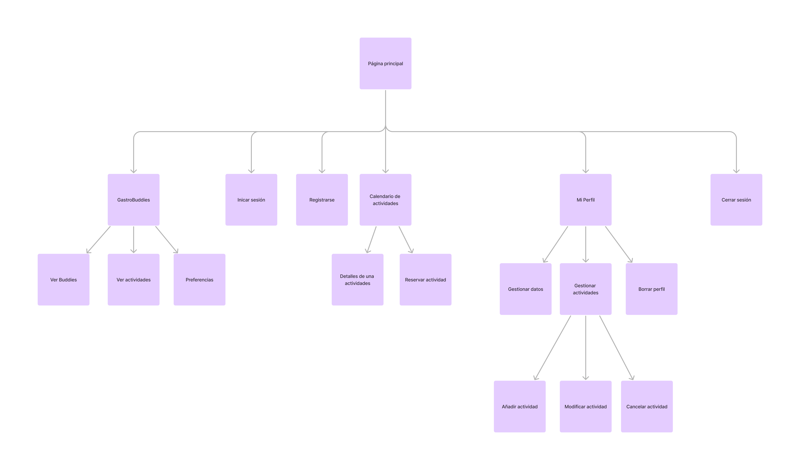  

>>> Identificar términos para diálogo con usuario  

Término | Significado     
| ------------- | -------
  Usuario  | Persona que interactúa con el sistema
  Usuario registrado  | Persona que ha formalizado el proceso de registrarse
  Usuario cliente  | Persona que ha registrado su perfil como cliente. Puede reservar actividades pero no puede publicar una actividad
  Usuario empresa  | Persona que ha registrado su perfil como empresa. Puede publicar sus actividades
  Página principal  | Es el punto de partida, aquí se muestra una visión general sobre los contenidos que ofrece este sitio web.
  GastroBuddies  | Agrupa la funcionalidad del módulo GastroBuddies  
  Ver Buddies  | Muestra una serie de sugerencias de eventos acordes a las preferencias que el usuario indicó en su perfil  
  Ver actividades  | Muestra la información sobre las actividades en las que participa el usuario
  Preferencias  | Permite al usuario establecer sus preferencias que se utilizaran para las recomendaciones de actividades (Ver buddies)
  Iniciar sesión  | Permite al usuario identificarse en el caso de que esté registrado en el sistema
  Registrarse  | Permite al usuario registrarse en el sistema si aún no está registrado
  Calendario actividades  | Este módulo ofrece una visión temporal y espacial sobre las actividades que están registrados en el sistema
  Detalles de una actividad  | Muestra toda la información correspondiente a una actividad
  Reservar actividad  | Permite al usuario reservar una actividad en la que el usuario está interesado.
  Mi Perfil  | Módulo que engloba la funcionalidad de gestión de los datos del usuario
  Gestionar datos  | Permite al usuario modificar sus datos
Gestionar actividades  | Permite al usuario gestionar las actividades que ha reservado
  Añadir actividad  | Permite al usuario empresa añadir una actividad que se mostrará en el calendario de actividades
  Modificar actividad  | Permite al usuario empresa editar la actividad que ha añadido
  Cancelar actividad  | Permite al usuario empresa borrar una actividad que ha registrado previamente. En el caso de ser usuario cliente permite cancelar la actividad que ha reservado previamente
Borrar perfil | Permite al usuario registrado borrar su perfil según la legislación europea de protección de datos

 2.d Wireframes
-----

[Bocetos](P2/Entrega/Entregables/Bocetos.pdf)  

## Wireframes
### Desktop
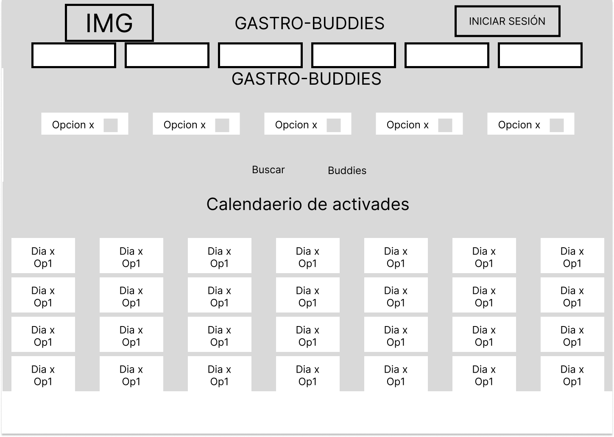

### Ipad
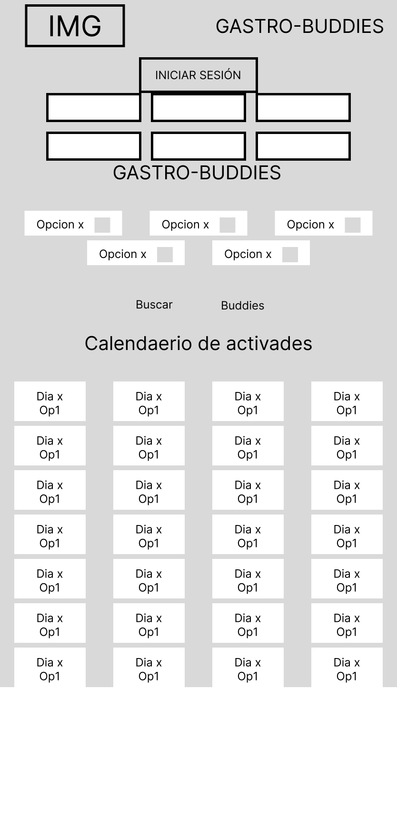

### Iphone
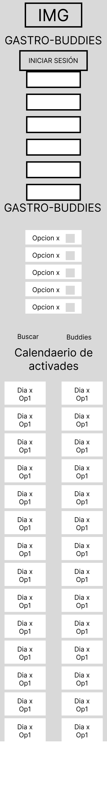

## Paso 3. Mi UX-Case Study (diseño)

 3.a Moodboard
-----

Cogemos de diferentes fuentes inspiracion y plasmamos la fuente para de un vstazo poder sacar una idea o imagen de a donde queremos llegar y que aspecto debe de tener.
   

  3.b Landing Page
----

En nuestro Landing Page, encontrarás más que solo una imagen. Es un espejo de nuestra identidad: vibrante, acogedora y llena de posibilidades. Desde el primer vistazo, te guiamos suavemente hacia donde necesitas estar, ofreciendo pistas claras sobre dónde encontrarnos. Pero más que eso, aquí respiras calma y curiosidad. Te invitamos a explorar, a sumergirte en lo desconocido con una sonrisa en el rostro.
 

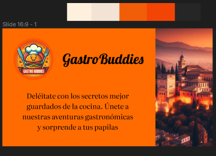
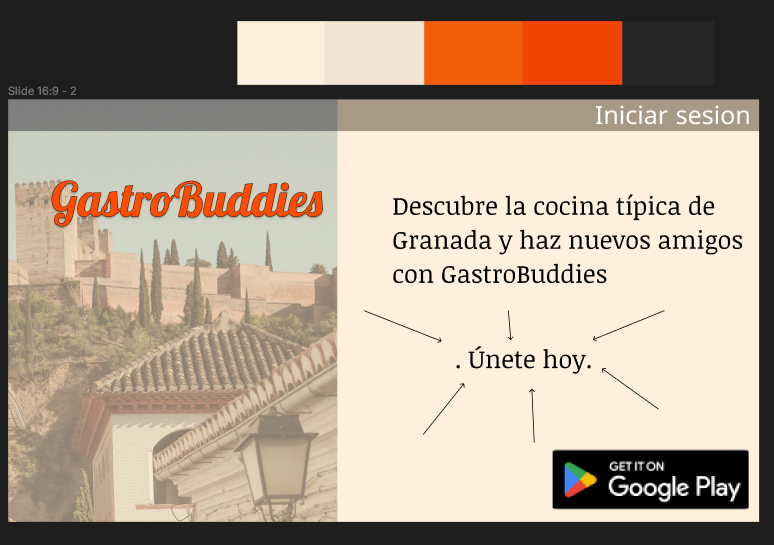

 3.c Guidelines
----

Tal y como sugiere el guion de la practica, se ha utilizado material ui. Se trata de un lenguaje de diseño desarrollado por Google que además trata de definir todas las caracteristicas de los elementos que forman una interfaz.  

De todos los elementos propuestos en el guion, debido a las limitaciones de la version gratuita de figma, se han utilizado:

- Onboarding
- Menu (navBar adaptada a móvil)
- Hero image + Carousel
- Form Input
- Item details + actions
- about

  3.d Mockup
----

[Enlace al prototipo FIGMA](https://www.figma.com/design/NjBneDsaPI1mtTUAXnyj0P/%5BDosVocesUnCompas%5DEsto-es-mi-Practica-3?node-id=54795%3A1898&t=0cC1bGppXBtk2T8i-1)
----
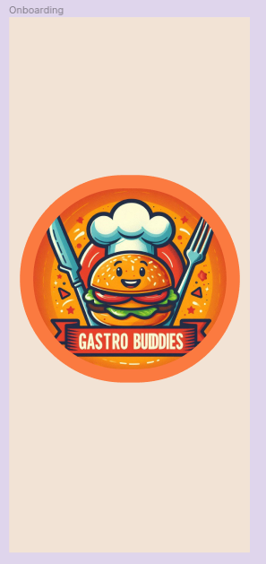

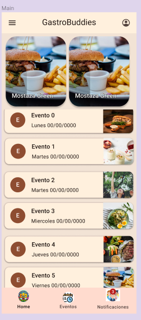

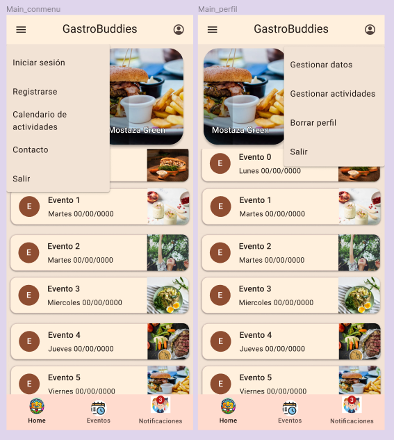

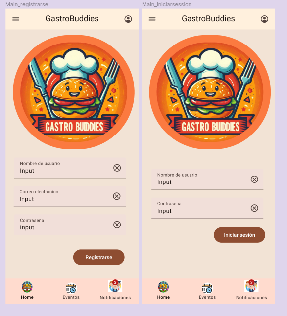

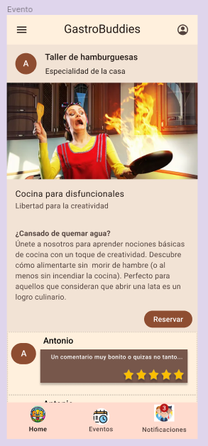

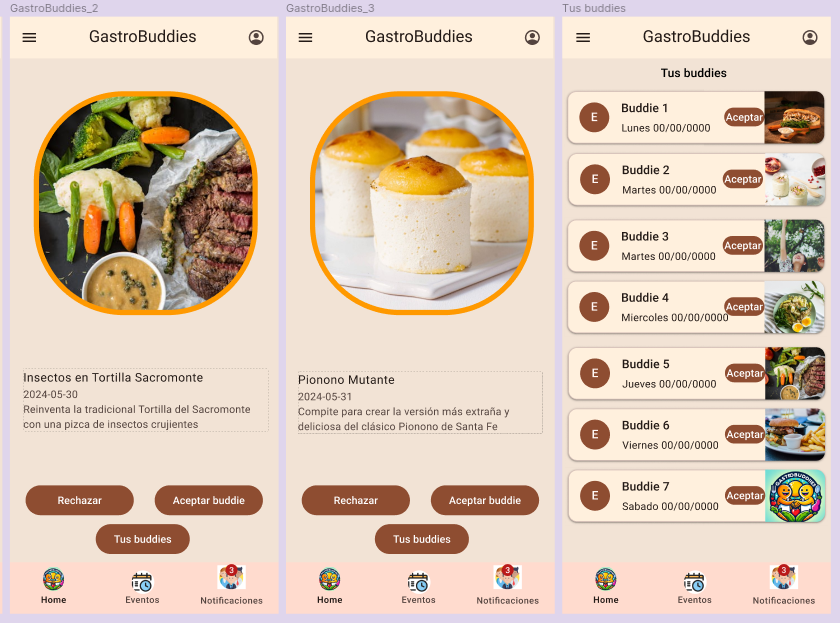

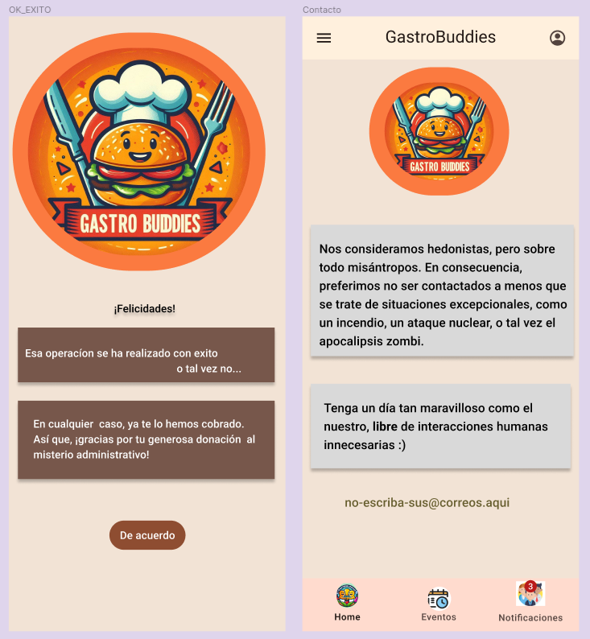

 3.e ¿My UX-Case Study?
-----

>>> Publicar my Case Study en Github..
>>> Documente y resuma el diseño de su producto

## Paso 5. Exportación & evaluación con Eye Tracking 

Exportación a HTML/Flutter
-----

)  5.b Eye Tracking method 

>>> Indica cómo diseñas experimento y reclutas usuarios (uso de gazerecorder.com)  

Diseño del experimento 
----

>> Uso de imágenes (preferentemente) -> hay que esablecer una duración de visualización y  
>> fijar las áreas de interes (AoI) antes del diseño. Planificar qué tarea debe hacer el usuario (buscar, comprar...) 

  
>> cambiar img por tu diseño de experimento  

>> Recordar que gazerecorder es una versión de pruebas: usar sólo con 3 usuarios para generar mapa de calor (recordar que crédito > 0 para que funcione) 

Resultados y valoración 
-----

>> Cambiar por tus resultados
  

## Paso 4. Evaluación 

 4.a Caso asignado
----

>>> Breve descripción del caso asignado con enlace a  su repositorio Github

 4.b User Testing
----

>>> Seleccione 4 personas ficticias. Exprese las ideas de posibles situaciones conflictivas de esa persona en las propuestas evaluadas. Asigne dos a Caso A y 2 al caso B
 

| Usuarios | Sexo/Edad     | Ocupación   |  Exp.TIC    | Personalidad | Plataforma | TestA/B
| ------------- | -------- | ----------- | ----------- | -----------  | ---------- | ----
| User1's name  | H / 18   | Estudiante  | Media       | Introvertido | Web.       | A 
| User2's name  | H / 18   | Estudiante  | Media       | Timido       | Web        | A 
| User3's name  | M / 35   | Abogado     | Baja        | Emocional    | móvil      | B 
| User4's name  | H / 18   | Estudiante  | Media       | Racional     | Web        | B 

 4.c Cuestionario SUS
----

>>> Usaremos el **Cuestionario SUS** para valorar la satisfacción de cada usuario con el diseño (A/B) realizado. Para ello usamos la [hoja de cálculo](https://github.com/mgea/DIU19/blob/master/Cuestionario%20SUS%20DIU.xlsx) para calcular resultados sigiendo las pautas para usar la escala SUS e interpretar los resultados
http://usabilitygeek.com/how-to-use-the-system-usability-scale-sus-to-evaluate-the-usability-of-your-website/)
Para más información, consultar aquí sobre la [metodología SUS](https://cui.unige.ch/isi/icle-wiki/_media/ipm:test-suschapt.pdf)

>>> Adjuntar captura de imagen con los resultados + Valoración personal 

 4.d Usability Report
----

>> Añadir report de usabilidad para práctica B (la de los compañeros)

>>> Valoración personal 

5.) Conclusion de EVALUACION (A/B testing + usability report + eye tracking) 
----

>> recupera el usability report de tu práctica (que es el caso B de los asignados a otros grupos) 
>> con los resultados del A/B testing, de eye tracking y del usability report:
>>  comentad en 2-3 parrafos cual es la conclusion acerca de la realización de la práctica y su evaluación con esas técnicas y que habéis aprendido

## Conclusión final / Valoración de las prácticas

>>> (90-150 palabras) Opinión FINAL del proceso de desarrollo de diseño siguiendo metodología UX y valoración (positiva /negativa) de los resultados obtenidos  

