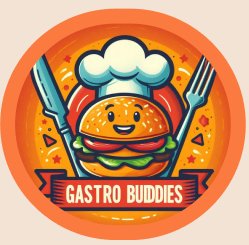
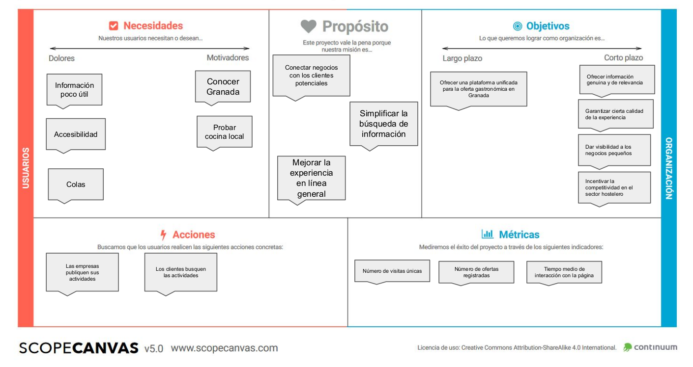
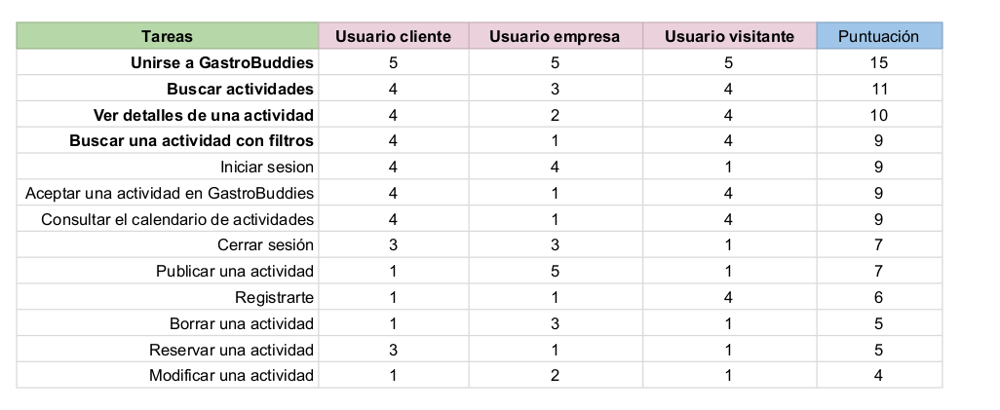
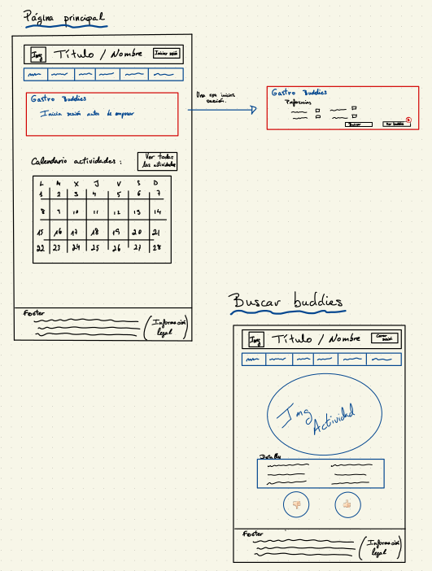
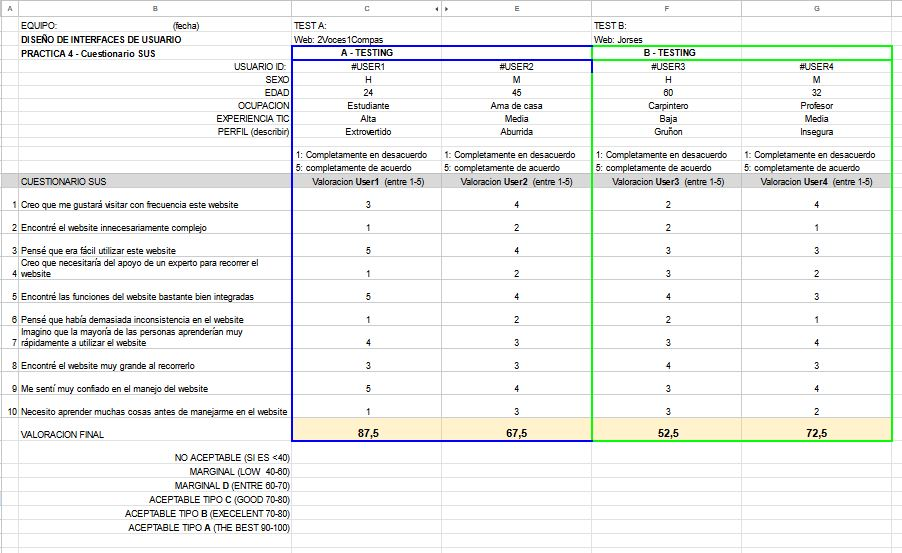

# DIU24
Prácticas Diseño Interfaces de Usuario 2023-24 (Tema: .... ) 

## Grupo: DIU2_DosVocesUnCompas.  Curso: 2023/24 Updated: 11/2/2024

## Proyecto: GastroBuddies

### Descripción: 
Logotipo: 

Este proyecto consiste en ofrecer una aplciación para los dispositivos moviles que permita conocer oferta gastrónomica en Granada y conocer gente. 

Miembros:
- Timur Sorokin sorokintimur@correo.ugr.es 
- AAA AAA AAA

----- 

# Proceso de Diseño 

## Paso 1. UX User & Desk Research & Analisis

Para llevar a cabo nuestro estudio, nos hemos enfocado en las ofertas gastronómicas ya existentes en Granada y en las opiniones de las personas sobre estas ofertas prestando especial interes a las posibles necesidades y frustraciones que pueden tener los hipoteticos usuarios.

---

## 1.b Competitive Analysis
En primer lugar, a parte de la sugerencia de la página propuesta en el guion, hemos realizado una busqueda de posibles competidores de los cuales hemos escogido dos:
- [Patata Santa](https://www.patatasanta.com/)
  
  una revista gastronómica en la que se destaca su sección de articulos. En este se puede descrubrir los diferentes lugares de indole gastronomico  de españa.

- [Garnata Tours](https://www.garnatatours.com/) 

una página de actividades turisticas. Su relevancia como competidor es su catalogo que incluye, además de visitas turisticas, las distintas actividades culinarias. 

En el documento presentado a continuación, se puede ver el análisis con la puntuación de los competidores escogidos. 

Finalmente, para concluir, el ranking según la puntuación queda tal que así:
- 1º Granada Cooking  
- 2º Patata Santa  
- 3º Garnata 

---

## 1.c Persona
A continuación, se presentan dos personas ficticias:
### 1.c.1 Carmen Maria
#### ¿Por que Maria?
>Carmen es una mujer de naturaleza artística, es bastante directa y no suele andar con rodeos. Suele decir las cosas tal y como las piensa, cosa que a veces le da un aire cateto y brusco a pesar de su refinado gusto músical. 

>Pasa muchas horas delante del piano pues está entregada al arte al 110% lo que le permite ofrecer un espectáculo de calidad y de muy alto nivel. No obstante, el precio a pagar
por volar tan alto es la soledad pues le queda muy poco tiempo para el ocio. 

>Tiene deseo de hacer nuevos amigos y conocer a nuevas personas.
Confiemos en que lo consiga en breve pues ahora mismo está en Granada y tiene ganas de descubrir la gastronomía local.

  

### 1.c.2 Antonio Martin
#### ¿Por que Antonio?
>Antonio es un hombre de mediana edad inglés que se dispone a visitar granada. Esta es la premisa
principal sobre la que se desarrolla.
Teniendo en cuenta que nos basamos en la ciudad de granada para desarrollar la actividad donde
prolifera el turismo tener en cuenta a una persona cuyo origen es otro país puede ser una gran idea

  

## 1.d User Journey Map
### 1.d.1 Carmen Maria
>Carmen decide buscar sitios donde poder vivir
experiencias gastronómicas. Para ello decide usar internet. A continuación se ofrecen los pasos que realiza y las emociones que le acompañnan

### 1.d.2 Antonio Martin
>Antonio es un hombre de mediana edad inglés que se dispone a visitar granada. Esta es la premisa
principal sobre la que se desarrolla.
Teniendo en cuenta que nos basamos en la ciudad de granada para desarrollar la actividad donde
prolifera el turismo tener en cuenta a una persona cuyo origen es otro país puede ser una gran idea.

  

---

## 1.e Usability Review
Enlaces a las valoraciones de usabilidad (Usability Reviews):

🔗[Usability Rebiew](P1/Entrega/UsabilityReview.pdf)

🥈 Valoración final (numérica): 59/100 - Moderado

> Los usuarios pueden usar la página y llevar al cabo las operaciones básicas. No obstante, la experiencia deja mucho que desear...

## Paso 2. UX Design  

 2.a Reframing / IDEACION: Feedback Capture Grid / EMpathy map 
----

Una vez terminada la practica 1, continuamos el desarrollo de esta asignatura con un mapa de empatia de las personas ficticias que hemos ingeniado previamete, Carmen y Antonio. En este mapa intentaremos plasmar de forma especulativa, aunque tal vez estructurada, los aspectos tales como: 
- Lo que puede sentir el usuario
- Lo que hace y lo que dice
- Lo que podria escuchar
- Los beneficios y los incovenientes

El color azul está reservado para Anotio, mientras que el naranja para Carmen. 

[Mapa Empatia version pdf](Entrega/Entregables/Empathy%20Map%20Practica%202.pdf)
    

 2.b ScopeCanvas
----

Nuestra propuesta de valor consiste en ofrecer un servicio web que mitigue las carencias más comunes que suelen tener las páginas webs. En particular, queremos hacer hincapié en la relevancia y utilidad de la información alojada puesto que en muchas ocasiones esta no aparece de forma clara o está escondida detrás de un esquema de navegación anti intuitiva e inhumana. 

Nuestra meta es crear un entorno web donde la información sea accesible, relevante y fácil de encontrar, brindando a nuestros usuarios una experiencia satisfactoria y enriquecedora cada vez que acuden a nuestro servicio.

---

### Funcionalidad
Nuestro servicio trata de los siguientes módulos:
- **Usuarios**:
son tanto las personas que están interesadas en alguna actividad (clientes) como las que ofrecen servicios (empresas)

- **Actividades**:
Son servicios ofertados por las empresas con la información como Fecha, Precio, Lugar, Hora

- **Buscador**:
Permite buscar por etiquetas o palabras claves alguna actividad relacionada, por ejemplo: “Cocina andalusí”

- **Calendario**
Agrupa las actividades ofrecidas por fechas, proporcionando una visión temporal. 

- **Tinder de actividades (GastroBuddies)**
Este servicio extra está enfocado en fomentar la socialización. Para ello, se pretende que :

     1 - El usuario, mediante palabras claves, define el tipo de actividades que le gustaria realizar

  2 - Estas preferencias se utilizarán para mostrar al usuario las sugerencias relacionadas. De modo que el usuario puede aceptar o rechazar la sugerencia. 

  3 - Una vez que se haya llegado a un número minimo de interesados, se creará un grupo con los participantes y se reservará el sitio. 

  4 - Una vez terminada la actividad, los usuarios podrán valorar su experiencia en cuanto al sitio y los participantes.

A continuación, recogemos los puntos claves, o al menos de interes, que han de ser considerados para nuestra propuesta:

[Descripcion](P2/Entrega/Entregables/descripcion%20y%20propuesta%20de%20valor.pdf)   
[ScopeCanva](P2/Entrega/Entregables/scopecanva.pdf)

 2.b User Flow (task) analysis 
-----

El siguiente paso consiste en estimar las posibles acciones que deberían poder ser llevados a cabo por el usuario y finalmente plantear un prototipo de la página web. Para ello, presentamos task analysis y algunos flow 

 

 2.c IA: Sitemap + Labelling 
----

A continuación, ofrecemos nuestra visión en cuanto a la navegabilidad entre los elementos de nuestra página web.

  

A parte del esquema de navegación, definimos una serie de terminos que se utilizarán en cuanto a lo referente la nuestra página web que viene recogidos en la tabla a continuación. También, sugerimos sugerimos  la consulta de este documento [labeling.pdf](P2/Entrega/Entregables/labelling.pdf)

Término | Significado     
| ------------- | -------
  Usuario  | Persona que interactúa con el sistema
  Usuario registrado  | Persona que ha formalizado el proceso de registrarse
  Usuario cliente  | Persona que ha registrado su perfil como cliente. Puede reservar actividades pero no puede publicar una actividad
  Usuario empresa  | Persona que ha registrado su perfil como empresa. Puede publicar sus actividades
  Página principal  | Es el punto de partida, aquí se muestra una visión general sobre los contenidos que ofrece este sitio web.
  GastroBuddies  | Agrupa la funcionalidad del módulo GastroBuddies  
  Ver Buddies  | Muestra una serie de sugerencias de eventos acordes a las preferencias que el usuario indicó en su perfil  
  Ver actividades  | Muestra la información sobre las actividades en las que participa el usuario
  Preferencias  | Permite al usuario establecer sus preferencias que se utilizaran para las recomendaciones de actividades (Ver buddies)
  Iniciar sesión  | Permite al usuario identificarse en el caso de que esté registrado en el sistema
  Registrarse  | Permite al usuario registrarse en el sistema si aún no está registrado
  Calendario actividades  | Este módulo ofrece una visión temporal y espacial sobre las actividades que están registrados en el sistema
  Detalles de una actividad  | Muestra toda la información correspondiente a una actividad
  Reservar actividad  | Permite al usuario reservar una actividad en la que el usuario está interesado.
  Mi Perfil  | Módulo que engloba la funcionalidad de gestión de los datos del usuario
  Gestionar datos  | Permite al usuario modificar sus datos
Gestionar actividades  | Permite al usuario gestionar las actividades que ha reservado
  Añadir actividad  | Permite al usuario empresa añadir una actividad que se mostrará en el calendario de actividades
  Modificar actividad  | Permite al usuario empresa editar la actividad que ha añadido
  Cancelar actividad  | Permite al usuario empresa borrar una actividad que ha registrado previamente. En el caso de ser usuario cliente permite cancelar la actividad que ha reservado previamente
Borrar perfil | Permite al usuario registrado borrar su perfil según la legislación europea de protección de datos

 2.d Wireframes
-----

La imagen que aparece a continuación representa nuestra visión de la página web. Se trata de un simple esbozo a partir de cual pretendemos construir nuestro prototipo.

## Wireframes
### Desktop
Para los usuarios desktop, ofrecemos la siguiente representación esquemática. Los elementos a destacar son
- La cabecera que tendrá logo, opción de iniciar sesión y el menu de navegación.
- La parte central mostrará un calendario con todos los eventos disponibles. Queda pendiente establecer cómo se representarán múltiples eventos en un mismo día; sin embargo, en esta etapa, consideramos que es un aspecto trivial y tal vez, inlcuso, irrelevante.

### Ipad
Se sigue la misma idea que en el caso anterior siendo los elementos protagonistas la cabecera y el calendario. 

### Iphone

## Paso 3. Mi UX-Case Study (diseño)

En esta etapa, el enfoque del proyecto ha cambiado de una página web a una aplicación móvil. Por ello, hemos adaptado la funcionalidad planteada anteriormente en la medida de lo posible. Sin embargo, estos cambios significativos han dificultado la integración de algunos elementos desarrollados en prácticas anteriores, lo que ha dejado parte del trabajo intelectual previo sin aprovechar.

Para lograr una integración más coherente, sería necesario retroceder y replantear aspectos como la navegabilidad, el análisis de tareas, el flujo, y el etiquetado. Sin embargo, debido a la carga lectiva y el tiempo limitado, no siempre es posible realizar estos ajustes en profundidad.

A pesar de estas circunstancias, a continuación presentamos de la mejor manera posible los resultados obtenidos en la práctica 3

 3.a Moodboard
-----

En la imagen a continuación, presentamos el moodboard. Este se divide en dos partes, separadas por una línea gris en el centro: el brainstorming y el resultado final.

En la sección de brainstorming, hemos reunido los elementos de interés que podrían ser aprovechados para nuestra ~~pagina web~~ aplicación móvil. Primero, exploramos opciones para el logo del proyecto utilizando herramientas de inteligencia artificial para generar imágenes que podrían servir como logo. Luego, analizamos diversas herramientas para obtener una paleta de colores adecuada. También investigamos diferentes tipografías con el propósito de identificar aquellas que faciliten una lectura sencilla y clara.

Además, incluimos iconos cuyo significado se describe en el etiquetado presentado anteriormente en el punto 2c. Por último, intentamos identificar los sentimientos que debería provocar la interacción con la aplicación.

Finalmente, en la parte derecha, presentamos las conclusiones a las que llegamos después de finalizar el brainstorming.

  3.b Landing Page
----

A continuación se presenta dos versiones de landing page siendo la segunda la versión definitiva. En esta página el usuario podrá acceder a la descarga de nuestra aplicación. 
En cuanto al diseño, se ha escogido Alhambra como elemento identificativo de Granada y colores pastel para el deleite de la vista del usuario.

 3.c Guidelines
----

Hemos obedecido las sugerencias del guion y hemos utilizado material kit ui para nuestro prototipo. A continuación ofrecemos una lista de los elementos utilizados

- Onboarding
- Menu (navBar adaptada a móvil)
- Hero image + Carousel
- Form Input
- Item details + actions
- about

  3.d Mockup
----

A continuación dejamos dos enlaces:

- [Prototipo](https://www.figma.com/proto/NjBneDsaPI1mtTUAXnyj0P/%5BDosVocesUnCompas%5DEsto-es-mi-Practica-3?node-id=54795-1899&t=T8mgKNFmdSKIaoBl-1&scaling=scale-down&page-id=54795%3A1898&starting-point-node-id=54795%3A5529)

- [Proyecto Figma](https://www.figma.com/design/NjBneDsaPI1mtTUAXnyj0P/%5BDosVocesUnCompas%5DEsto-es-mi-Practica-3?node-id=54795%3A1898&t=0cC1bGppXBtk2T8i-1)
----
Elemento/s: onboarding

----

Elemento/s: carousel + hero image, NavBar, lista, item details, actions

----

----

Elemento/s: logo, button, form input

Elemento/s: card, comentarios, button

 3.e ¿My UX-Case Study?
-----

## Paso 4. Evaluación 

 4.a Caso asignado
----

>>> Breve descripción del caso asignado con enlace a  su repositorio Github

 4.b User Testing
----

>>> Seleccione 4 personas ficticias. Exprese las ideas de posibles situaciones conflictivas de esa persona en las propuestas evaluadas. Asigne dos a Caso A y 2 al caso B
 

| Usuarios | Sexo/Edad     | Ocupación   |  Exp.TIC    | Personalidad | Plataforma | TestA/B
| ------------- | -------- | ----------- | ----------- | -----------  | ---------- | ----
| Juan     | H / 24   | Estudiante   | Alta        | Extrovertido | Web          | A 
| Maria    | M / 45   | Ama de casa  | Media       | Aburrida     | Movil        | A 
| Pepe     | H / 60   | Carpintero   | Baja        | Gruñon       | Web          | B 
| Isabel   | M / 32   | Profesor     | Media       | Insegura     | Movil        | B 

 4.c Cuestionario SUS
----

>>> Usaremos el **Cuestionario SUS** para valorar la satisfacción de cada usuario con el diseño (A/B) realizado. Para ello usamos la [hoja de cálculo](https://github.com/mgea/DIU19/blob/master/Cuestionario%20SUS%20DIU.xlsx) para calcular resultados sigiendo las pautas para usar la escala SUS e interpretar los resultados
http://usabilitygeek.com/how-to-use-the-system-usability-scale-sus-to-evaluate-the-usability-of-your-website/)
Para más información, consultar aquí sobre la [metodología SUS](https://cui.unige.ch/isi/icle-wiki/_media/ipm:test-suschapt.pdf)

>>> Adjuntar captura de imagen con los resultados + Valoración personal

---

 4.d Usability Report
----

>> Añadir report de usabilidad para práctica B (la de los compañeros)

>>> Valoración personal 

5.) Conclusion de EVALUACION (A/B testing + usability report + eye tracking) 
----

>> recupera el usability report de tu práctica (que es el caso B de los asignados a otros grupos) 
>> con los resultados del A/B testing, de eye tracking y del usability report:
>>  comentad en 2-3 parrafos cual es la conclusion acerca de la realización de la práctica y su evaluación con esas técnicas y que habéis aprendido

## Paso 5. Exportación & evaluación con Eye Tracking 

Exportación a HTML/Flutter
-----

)  5.b Eye Tracking method 

>>> Indica cómo diseñas experimento y reclutas usuarios (uso de gazerecorder.com)  

Diseño del experimento 
----

>> Uso de imágenes (preferentemente) -> hay que esablecer una duración de visualización y  
>> fijar las áreas de interes (AoI) antes del diseño. Planificar qué tarea debe hacer el usuario (buscar, comprar...) 

  
>> cambiar img por tu diseño de experimento  

>> Recordar que gazerecorder es una versión de pruebas: usar sólo con 3 usuarios para generar mapa de calor (recordar que crédito > 0 para que funcione) 

Resultados y valoración 
-----

>> Cambiar por tus resultados
  

## Conclusión final / Valoración de las prácticas

>>> (90-150 palabras) Opinión FINAL del proceso de desarrollo de diseño siguiendo metodología UX y valoración (positiva /negativa) de los resultados obtenidos  

